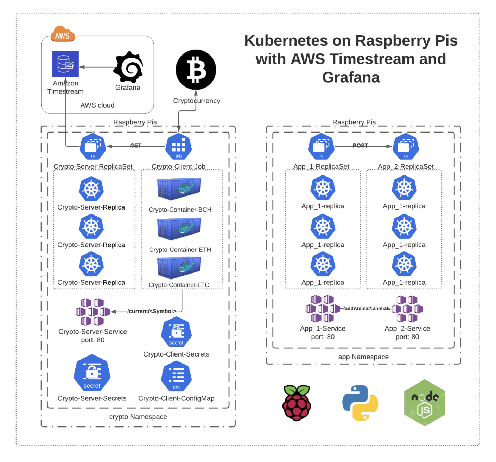

# AWSMeetupGroup: Kubernetes on Raspberry Pis with AWS Timestream and Grafana

In this project we build and deploy a Kubernetes Cluster on a fleet of Raspberry Pis, store Cryptocurrency data in AWS Timesteam, and visualize the data in Grafana. Slides: [https://docs.google.com/presentation/d/1UA9DZpcFKJ0k_DWdUSXU0P6iH1OJUMrJhgO46yRZv18/edit?usp=sharing](https://docs.google.com/presentation/d/1UA9DZpcFKJ0k_DWdUSXU0P6iH1OJUMrJhgO46yRZv18/edit?usp=sharing)

  

